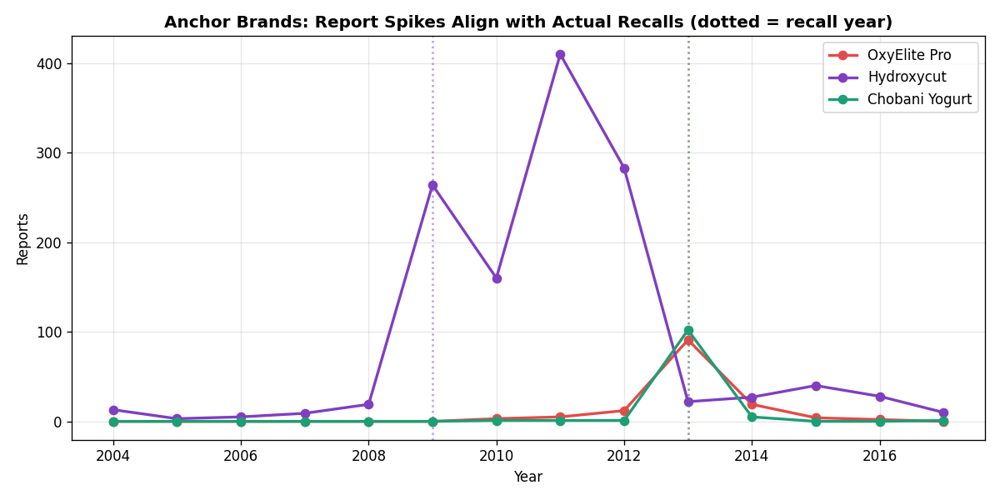
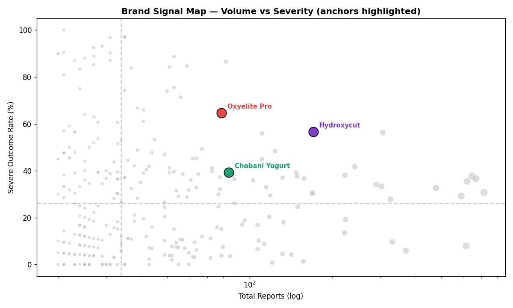
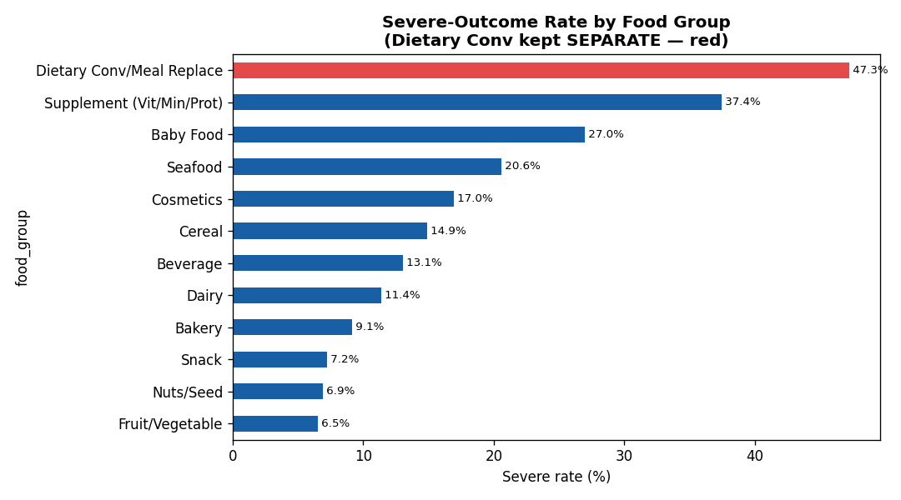

# FDA CAERS 식품 안전 신호 탐지 프로젝트

> FDA CAERS 식품·건강기능식품 부작용 신고 데이터를 활용해 **식품군별 위험 패턴**과 **브랜드 단위 이상 신호**를 탐지한 데이터 분석 프로젝트입니다.  
> 기존 팀 프로젝트의 EDA 결과를 바탕으로, 문제 정의·전처리 기준·자동 신호탐지·대시보드 산출물까지 포트폴리오 형태로 재구성했습니다.

---

## 1. 프로젝트 한 줄 요약

자발신고 기반 식품 부작용 데이터에서 **신고 급증 + 고위험 결과 비율**을 결합해 조사 우선순위가 높은 브랜드를 자동으로 선별하고, 실제 리콜 사례와 대조해 탐지 결과를 검증했습니다.

---

## 2. 문제 정의

### 비즈니스 관점

| 항목 | 내용 |
| --- | --- |
| 사용자 | 식품 안전 모니터링 담당자, 품질/리스크 관리 담당자 |
| 문제 상황 | 식품·건강기능식품 부작용 신고가 누적되지만, 어떤 식품군·브랜드를 우선 조사해야 하는지 빠르게 판단하기 어렵다. |
| 목표 | 신고 패턴에서 위험 신호를 조기에 포착해 조사 우선순위를 제시한다. |
| 기대 효과 | 수작업 탐색 시간을 줄이고, 리콜·안전 이슈 가능성이 높은 대상을 빠르게 선별한다. |

### 데이터 분석 관점

| 항목 | 내용 |
| --- | --- |
| 분석 대상 | FDA CAERS 식품 부작용 신고 데이터, 2004년~2017년 Q2 |
| 주요 단위 | 신고 건, 식품군, 브랜드, 연도, 증상, 결과(outcome) |
| 핵심 질문 | 특정 브랜드의 신고가 비정상적으로 급증했는가? 급증 브랜드가 고위험 결과 비율도 높은가? |
| 문제 유형 | EDA + 비지도 규칙 기반 이상 신호 탐지 |
| 최종 출력 | 브랜드별 `watch_score`, 급증 시작 연도, 고위험율, 대시보드 |

---

## 3. 데이터 설명

- 원천 데이터: FDA CAERS ASCII 2004~2017 Q2
- 행 수: 약 90,786건
- 주요 컬럼
  - 신고 번호: `ra_report`
  - 신고/발생일: `created_date`, `start_date`
  - 제품/브랜드: `brand`
  - 산업군: `industry`, `industry_code`
  - 소비자 정보: `age`, `age_unit`, `gender`
  - 결과: `outcomes`
  - 증상: `symptoms`

원본 CSV는 용량과 재배포 관리 이슈를 줄이기 위해 `data/raw/`에는 포함하지 않았습니다.  
대신 바로 실행 가능한 파생 데이터(`data/processed/caers_clean.csv`, `brand_signals.csv`)와 정적 대시보드(`app/dashboard.html`)를 포함했습니다.

---

## 4. 분석 흐름

```text
문제 정의
→ 원본 데이터 구조 파악
→ 전처리 기준 보정
→ 식품군/연령/심각도 EDA
→ 브랜드별 신고 시계열 집계
→ 급증 신호 탐지
→ 고위험율과 결합한 watch_score 산출
→ 실제 리콜 사례와 대조 검증
→ 대시보드 및 문서화
```

---

## 5. 주요 개선 사항

| 영역 | 기존 팀 분석 | 개선 내용 |
| --- | --- | --- |
| 심각도 정의 | 코드와 시각화 기준이 일부 불일치 | FDA serious 기준과 severe 상위 티어를 분리해 통일 |
| 식품군 분류 | 식사대용식이 건강기능식품에 병합 | 별도 식품군으로 분리해 숨은 위험 신호 확인 |
| 나이 전처리 | 월/주/일 단위 나이를 정수 절삭 | 연 단위 소수값으로 변환해 영아 정보 손실 완화 |
| 브랜드 분석 | 이상 브랜드를 수작업으로 확인 | 신고 급증 + 고위험율 기반 자동 신호탐지 구현 |
| 산출물 | 노트북/발표 중심 | 코드, 문서, 정적 HTML, Streamlit 대시보드 구조화 |

자세한 변경 근거는 [`docs/00_changes_from_team_baseline.md`](docs/00_changes_from_team_baseline.md)를 참고하세요.

---

## 6. 신호 탐지 방법

브랜드별 위험 신호는 두 가지 축을 결합했습니다.

1. **정적 위험도**  
   브랜드별 고위험 결과 비율(`severe_rate`)을 계산합니다.

2. **시계열 급증도**  
   연도별 신고 건수에서 피크 연도, 전년 대비 급증 시작 연도, 피크 배수를 계산합니다.

최종 점수는 다음 방식으로 산출했습니다.

```text
watch_score = severe_rate 백분위 × 0.5 + peak_ratio 백분위 × 0.5
```

이 점수는 “위험 확정”이 아니라 **조사 우선순위**입니다.  
자발신고 데이터에는 판매량 분모, 언론 보도 효과, 신고 편향이 존재하기 때문입니다.

상세 방법은 [`docs/01_signal_detection.md`](docs/01_signal_detection.md)를 참고하세요.

---

## 7. 핵심 결과

### 1) 팀이 수작업으로 찾은 위험 브랜드를 자동 탐지로 재현

- OxyElite Pro
- Hydroxycut

두 브랜드 모두 `watch_score` 상위권에 포착되었고, 신고 급증 연도가 실제 FDA 리콜 연도와 정렬되었습니다.



### 2) 브랜드 신호맵으로 조사 우선순위 시각화

신고량, 고위험율, 위험점수를 함께 시각화해 우선 조사 대상을 빠르게 파악할 수 있도록 구성했습니다.



### 3) 식품군별 심각도 차이 확인

식사대용식을 건강기능식품에 병합하지 않고 별도 분리했을 때, 기존 분석에서 희석되던 신호가 더 명확하게 드러났습니다.



---

## 8. 대시보드

### 설치 없이 보기

`app/dashboard.html` 파일을 브라우저에서 열면 됩니다.

- 데이터 내장형 정적 HTML
- GitHub Pages 배포 가능
- Plotly CDN 사용

### Streamlit으로 실행

```bash
pip install -r requirements.txt
streamlit run app/dashboard.py
```

대시보드 사용법은 [`docs/02_dashboard_guide.md`](docs/02_dashboard_guide.md)를 참고하세요.

---

## 9. 프로젝트 구조

```text
fda-caers-github-ready/
├── README.md
├── requirements.txt
├── .gitignore
├── app/
│   ├── dashboard.html          # 설치 없이 볼 수 있는 정적 대시보드
│   ├── dashboard.py            # Streamlit 대시보드
│   └── dashboard_data.json
├── data/
│   ├── raw/
│   │   └── README.md           # 원본 데이터 배치 안내
│   └── processed/
│       ├── caers_clean.csv     # 전처리 완료 데이터
│       └── brand_signals.csv   # 브랜드 신호탐지 결과
├── docs/
│   ├── 00_changes_from_team_baseline.md
│   ├── 01_signal_detection.md
│   ├── 02_dashboard_guide.md
│   ├── 03_project_framework.md
│   └── 04_github_upload_guide.md
├── figures/
│   └── fig1~fig5.png
└── src/
    ├── preprocess.py
    ├── signal_detection.py
    ├── build_figures.py
    ├── build_dashboard_data.py
    └── labels.py
```

---

## 10. 재현 방법

원본 CSV를 직접 받아 재현하려면 `data/raw/README.md` 안내에 따라 원본 파일을 배치한 뒤 아래 순서로 실행합니다.

```bash
pip install -r requirements.txt
python src/preprocess.py
python src/signal_detection.py
python src/build_figures.py
python src/build_dashboard_data.py
streamlit run app/dashboard.py
```

---

## 11. 한계 및 해석 주의

- CAERS는 자발신고 데이터이므로 실제 발생률을 의미하지 않습니다.
- 판매량 또는 노출 인구 수가 없어 위험률을 직접 계산할 수 없습니다.
- 리콜 보도 이후 신고가 증가하는 미디어 효과가 섞일 수 있습니다.
- 따라서 본 프로젝트의 결과는 “위험 확정”이 아니라 “조사 우선순위 추천”으로 해석해야 합니다.

---

## 12. 포트폴리오 관점에서의 의의

이 프로젝트는 단순 EDA를 넘어서 다음 흐름을 갖도록 재구성했습니다.

```text
현장 문제 정의
→ 데이터 기준 보정
→ 탐색적 분석
→ 규칙 기반 신호탐지 알고리즘 구현
→ 실제 사건과 검증
→ 대시보드 산출물화
→ 한계와 운영 해석 명시
```

즉, “그래프를 그린 프로젝트”가 아니라 **식품 안전 모니터링 의사결정을 지원하는 분석 파이프라인**으로 정리한 프로젝트입니다.
